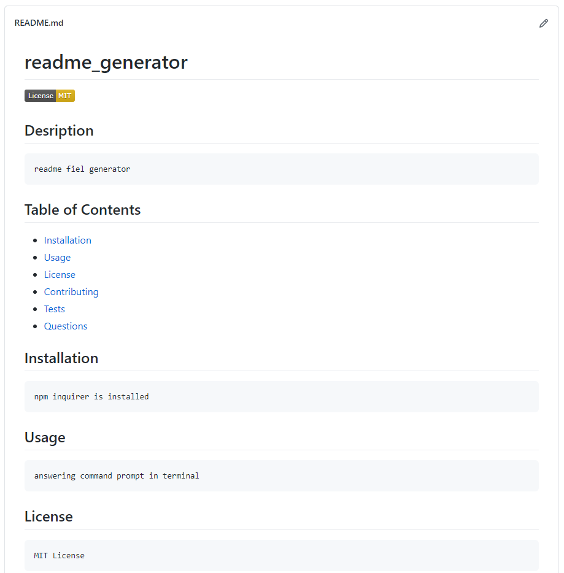

# readme_generator

## Desription
    readme file generator

## Table of Contents
 - [Installation](#installation)
 - [Usage](#usage)
 - [License](#license)
 - [Contributing](#contributing)
 - [Tests](#tests)
 - [Questions](#questions)

## Installation
    ensure npm inquirer is installed      
## Usage
    answering questions in the command prompt
## License
    MIT License
## Contributing
    Nick Leoni
## Tests
    multiple command line tests
## Questions
[GitHub Repo Link](https://github.com/njleoni/readme_generator)
[Screencastify Link](https://drive.google.com/file/d/1OGCGkxQykXynQv58nLxzmi8psXL6SL2q/view)
#### If you have any additional questions, please contact me at nicholas.leoni@gmail.com

## Screenshot

